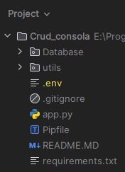

# Aplicación CRUD de Consola con Python, MySQL y ORM Peewee.
Este es un pequeño proyecto CRUD por consola con Python, MySQL y el ORM Peewee.
En el proyecto se usaron las siguientes bibliotecas:
- [PyMySQL](https://pypi.org/project/pymysql/) (para la conexion con la base de datos y peewee)
- [dotenv](https://pypi.org/project/python-dotenv/) (para el seteo de las variables de entono seteadas en el archivo .env)
- [Peewee](https://docs.peewee-orm.com/en/latest/) (ORM)

Para que el proyecto funcione correctamente en la carpeta Database se encuentra un archivo con extencion .sql
con el cual se podra generar la base de datos en mysql.

Además, se devera generar en la raiz un archivo .env con las credenciales para la conexion a la base de datos.

